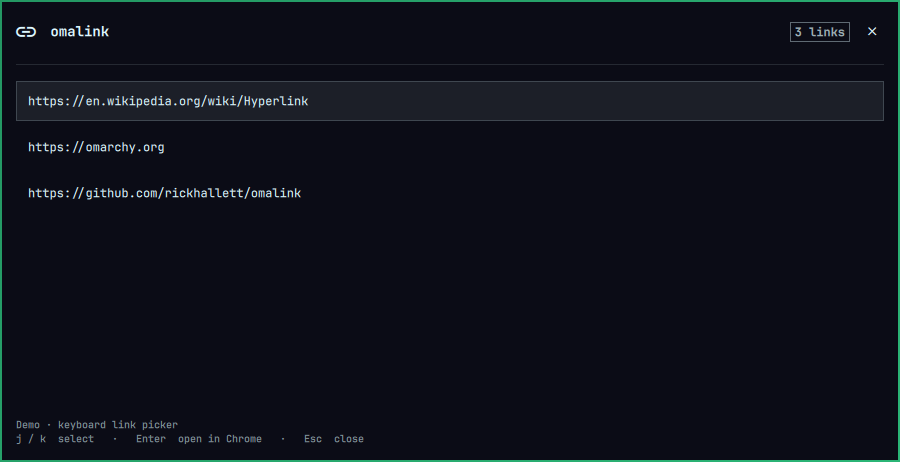

# omalink



Pick visible links from the keyboard, including destinations hidden behind browser link labels.

**Super+U** reads the focused window and opens a centred, theme-aware Omarchy panel. Select with **j/k** or **↓/↑**, **Enter** opens in Chrome, **Esc** closes. **Super+Shift+U** scans the whole focused monitor instead.

Omalink first reads Foot's visible text or Chrome's native accessibility tree. Other applications use local Tesseract OCR. Exact repeat screenshots reuse a short-lived result cache. Python coordinates the work; the expensive pixel recognition runs in Tesseract's native engine.

On this machine, the direct paths reached the summon stage in **71 ms for Foot** and **104 ms for Chrome**, before the panel's own animation. On a frozen desktop sample, focused-window OCR with one thread took **2.01 s**, compared with **7.31 s** for the original full-monitor/default-thread OCR. These are measured samples, not latency guarantees. See [the experiment report](benchmarks/RESULTS.md).

## Behaviour

- Foot uses `pipe-visible`, without changing the clipboard or reading scrollback. Terminals opened before the bridge was installed retain OCR in the same j/k panel; open a new terminal to enable exact text extraction. Existing sessions are never restarted automatically. Omalink does not switch to Foot’s letter-hint interface.
- Chrome uses AT-SPI, restricted to the active browser frame's visible web document. It reads link destinations, including labelled links and links exposed from shadow DOM. Editable fields are skipped. Offscreen and `display:none` fixture links were excluded. Accessibility visibility is semantic: occlusion, transparent elements, and partly clipped text can differ from pixel visibility.
- A missing, failed or slow text provider falls back to OCR. Chrome accessibility runs in a separate process with a 650 ms limit; traversal has a smaller time/node budget. A responsive provider without links also falls back, allowing links in images or browser UI to be found.
- OCR captures the window at its monitor's scale, then enlarges the image 2× before recognition to reduce small-text m/n confusion. Whole-monitor mode deliberately bypasses the text bridges. One Tesseract thread was fastest in the measured matrix.
- The footer shows the source and processing time. Launching again keeps the latest request; old OCR cannot overwrite newer direct results. Closing during OCR does not reopen the picker.

Chrome's most recently focused normal window is focused before opening a new tab. Chrome's single-instance handling reuses the running browser or starts one if absent. Existing profiles and sessions are preserved.

## Install

Early release for Omarchy Quattro. OCR can corrupt small text and query strings; check destinations before opening. Direct text is preferred for supported sessions.

Dependencies: Python 3, ImageMagick (`magick`), `grim`, `tesseract`, `tesseract-data-eng`, Google Chrome, Hyprland, and Omarchy's Quickshell. Optional Chrome text extraction also requires `python-gobject` and `at-spi2-core`. No Python package installation is required.

```sh
omarchy plugin add https://github.com/rickhallett/omalink --enable
mkdir -p ~/.local/bin
ln -s ~/.config/omarchy/plugins/ms02.omalink/omalink.py ~/.local/bin/omalink
```

The symlink command refuses to replace an existing command. If `omalink` already exists, inspect it before making changes. Launch `omalink capture` from your terminal, or add these bindings to your existing `~/.config/hypr/bindings.lua`:

```lua
o.bind("SUPER + U", "Open a visible URL", os.getenv("HOME") .. "/.local/bin/omalink capture")
o.bind("SUPER + SHIFT + U", "Open a visible URL (whole monitor)", os.getenv("HOME") .. "/.local/bin/omalink capture --monitor")
```

Check for conflicting shortcuts before adding them, then run `hyprctl reload` and `hyprctl configerrors`.

The native panel uses Omarchy theme tokens. Adding/enabling the plugin does not install packages, create commands, or modify terminal, browser, or shortcut settings automatically.

### Optional direct text bridges

Inspect the proposed configuration changes, then explicitly apply them:

```sh
/usr/bin/python3 ~/.config/omarchy/plugins/ms02.omalink/install_integrations.py
/usr/bin/python3 ~/.config/omarchy/plugins/ms02.omalink/install_integrations.py --apply
```

The installer adds a Foot visible-text shortcut and a Chrome accessibility launcher with a local desktop override. Existing changed configurations receive timestamped backups. New Foot processes and the next ordinary Chrome process load the bridges; existing processes keep the OCR fallback. It does not close either application.

Enabling Chrome's accessibility tree has some browser-side processing/memory cost; whole-browser overhead has not been benchmarked. No browser extension, remote debugging port, background screenshot polling, or additional omalink daemon is installed.

### Remove

1. Remove the two omalink shortcut lines you added, then reload Hyprland.
2. Remove the `omalink` command symlink if it points to this plugin.
3. If you enabled direct text, remove the labelled omalink `pipe-visible` line from `~/.config/foot/foot.ini`. In the local `google-chrome.desktop` override, change only Exec paths pointing at the omalink browser wrapper back to `/usr/bin/google-chrome-stable`; preserve other customizations. The timestamped backups provide the original entries. Then remove `~/.local/share/omalink/bin/google-chrome-stable`.
4. Run `omarchy plugin remove ms02.omalink`. Optionally remove `~/.config/omalink` and the temporary `$XDG_RUNTIME_DIR/omalink` data after checking their contents.

No background omalink service needs disabling. The optional website preview is separate from the plugin.

## Configuration and commands

`~/.config/omalink/config.json`:

```json
{"scope":"window","threads":1,"cache_ttl_s":30,"direct":true}
```

`scope` can be `window` or `monitor`; threads can be 1, 2 or 4. Cache lifetime is capped at 300 seconds; zero disables it. `direct: false` skips text providers. Configuration is read on each invocation.

```sh
omalink capture
omalink capture --monitor
omalink demo
omalink extract 'See https://example.com/docs and github.com/rickhallett/omatag'
omalink open https://example.com
omarchy-shell omalink status
```

The backend accepts HTTP(S) URLs and existing local image paths/file URLs. Local images open in Chrome through encoded `file://` URLs. It deduplicates URLs, trims surrounding punctuation, preserves query strings, repairs scheme spacing, and recognises `www` and common bare-domain endings. Truncated addresses are skipped; OCR errors or arbitrary line wrapping can still produce incomplete URLs.

When an unresolved `[Image #N]` label appears, up to five recent images from `$CODEX_HOME/generated_images` are offered as explicitly labelled **candidates**, not an exact label-to-file mapping. Foot's plain text pipe generally does not expose hidden hyperlink destinations. Existing visible local paths and image file URLs are extracted directly.

## Local data

Screenshots live temporarily under `$XDG_RUNTIME_DIR/omalink` and are deleted after OCR. A later invocation removes captures older than five minutes left by interrupted processes. The cache stores extracted URLs and an image-label flag, never full OCR text or screenshots; expired entries are pruned on the next OCR call. It retains approximately 16 entries in a private runtime directory. Changing even one pixel causes a cache miss.

`timings.jsonl` in the same runtime directory contains only source, duration, capture duration and link count. It is size-bounded and contains no URLs, paths, titles or extracted text. Nothing is uploaded; the clipboard remains unchanged.

## Verification

```sh
/usr/bin/python3 -m unittest discover -v
omarchy plugin validate .
/usr/bin/python3 benchmarks/direct_smoke.py
/usr/bin/python3 benchmarks/accessibility_smoke.py
/usr/bin/python3 benchmarks/cache_smoke.py
/usr/bin/python3 benchmarks/panel_smoke.py
```

The desktop smoke tests briefly open disposable test windows/panels and close only those they create. The OCR matrix additionally samples the visible screen; screenshots and text stay in temporary runtime storage, with only timings/counts/result hashes retained. See [results and limitations](benchmarks/RESULTS.md).

For a quick OCR-only mode, set `direct` to `false`. This stops omalink using the bridges but does not disable Chrome's accessibility tree; see removal above.

## Website preview

```sh
/usr/bin/python3 -m http.server 4173 --bind 127.0.0.1 --directory website
```

Open http://127.0.0.1:4173. The website's interactive picker is a simulation and does not capture the desktop.

`plugin/LinkPopup.qml` derives from Omarchy's `Ui/KeyboardPanel.qml`, with central placement. Upstream MIT terms are retained in LICENSE.
